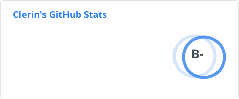

<h1 align="center">Clerin</h1>

  <strong>Game Client Development · Graphics Programming · Technical Art</strong> 
  C# / C++ developer based in South Korea.

  
  

## About Me

- Building **game client systems** with C# and C++
- Bridging **art and engineering** through technical art workflows
- Exploring **real-time rendering**, graphics APIs, and performance fundamentals

## Languages & Tools

| Area | Technologies |
| :--- | :--- |
| Languages |   |
| Game engines |   |
| Graphics APIs |   |
| Version control |  |

## GitHub Activity

  

