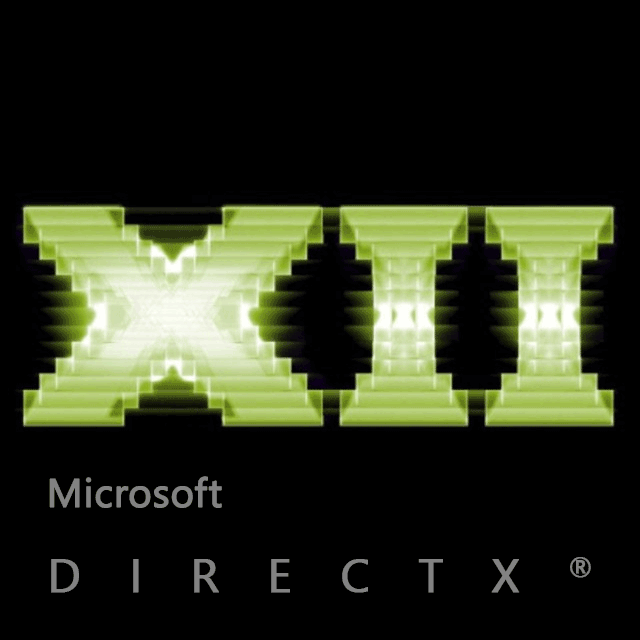

<h1 align="center">Clerin</h1>

  <strong>Game Client Development · Graphics Programming · Technical Art</strong> 
  C# / C++ developer based in South Korea.

  <a href="https://techblog.clerindev.com/">Technical Blog</a> &nbsp;·&nbsp;
  <a href="https://www.youtube.com/@clerin_dev">YouTube</a>

## About Me

- Building **game client systems** with C# and C++
- Bridging **art and engineering** through technical art workflows
- Exploring **real-time rendering**, graphics APIs, and performance fundamentals

## Languages & Tools

| Area | Technologies |
| :--- | :--- |
| Languages |  **C#** &nbsp;·&nbsp;  **C++** |
| Game engines |  Unity &nbsp;·&nbsp;  Unreal Engine |
| Graphics APIs |  OpenGL &nbsp;·&nbsp;  DirectX 12 |
| Version control |  Git |

## GitHub Activity

  

  

