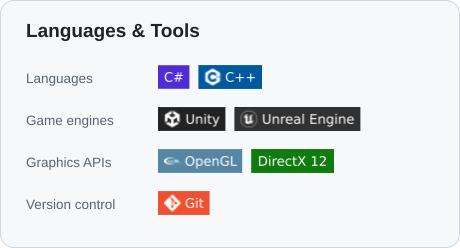
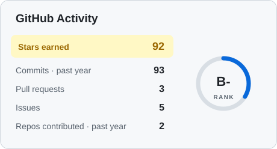

<h1 align="center">Clerin</h1>

  <strong>Game Client Development · Graphics Programming · Technical Art</strong> 
  C# / C++ developer based in South Korea.

  
  

## About Me

- Building **game client systems** with Unity and Unreal Engine
- Bridging **art and engineering** through technical art workflows
- Exploring **real-time rendering**, graphics APIs, and performance optimization fundamentals

  <picture>
    <source media="(prefers-color-scheme: dark)" srcset="./profile/cards/tools-dark.svg" />
    
  </picture>
  <picture>
    <source media="(prefers-color-scheme: dark)" srcset="./profile/cards/stats-dark.svg" />
    
  </picture>

