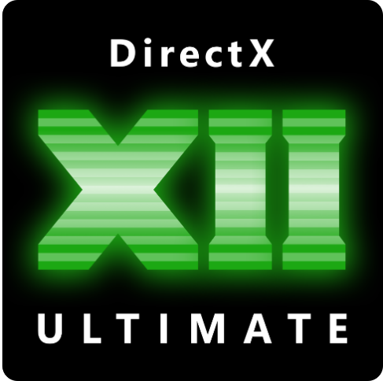

<h1 align="center">Clerin</h1>

  C#/C++ developer from Korea focused on client-side and graphics programming with Unity and Unreal Engine.

  
  

## Focus Areas

- Client-side gameplay and systems programming
- Real-time rendering fundamentals and graphics optimization
- Engine-side development with Unity and Unreal Engine
- Graphics API practice with OpenGL and DirectX 12

## Languages and Tools

  
  
  
  
  
  
  

## GitHub Stats

<table>
  <tr>
    <td>
      
    </td>
    <td>
      
    </td>
  </tr>
</table>

> Stats cards are updated daily by GitHub Actions (`.github/workflows/grs.yml`).

## Connect

- YouTube: [@clerin_dev](https://www.youtube.com/@clerin_dev)
